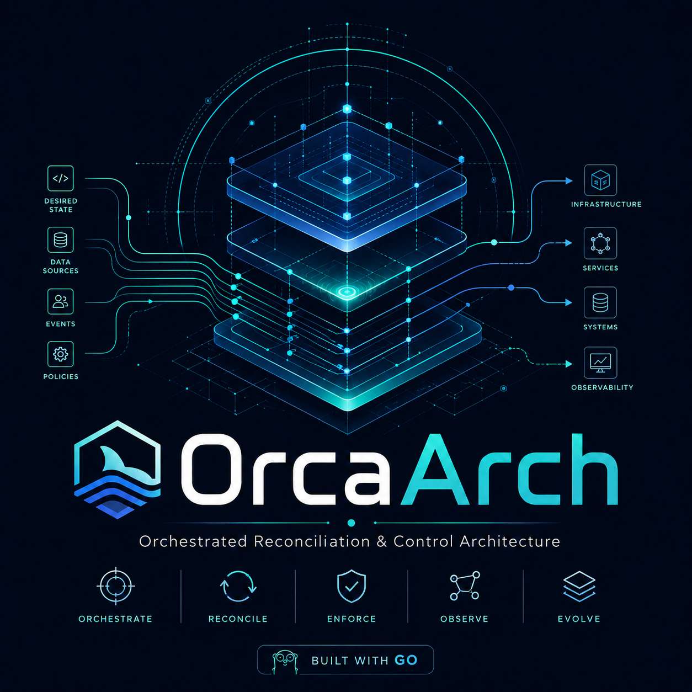
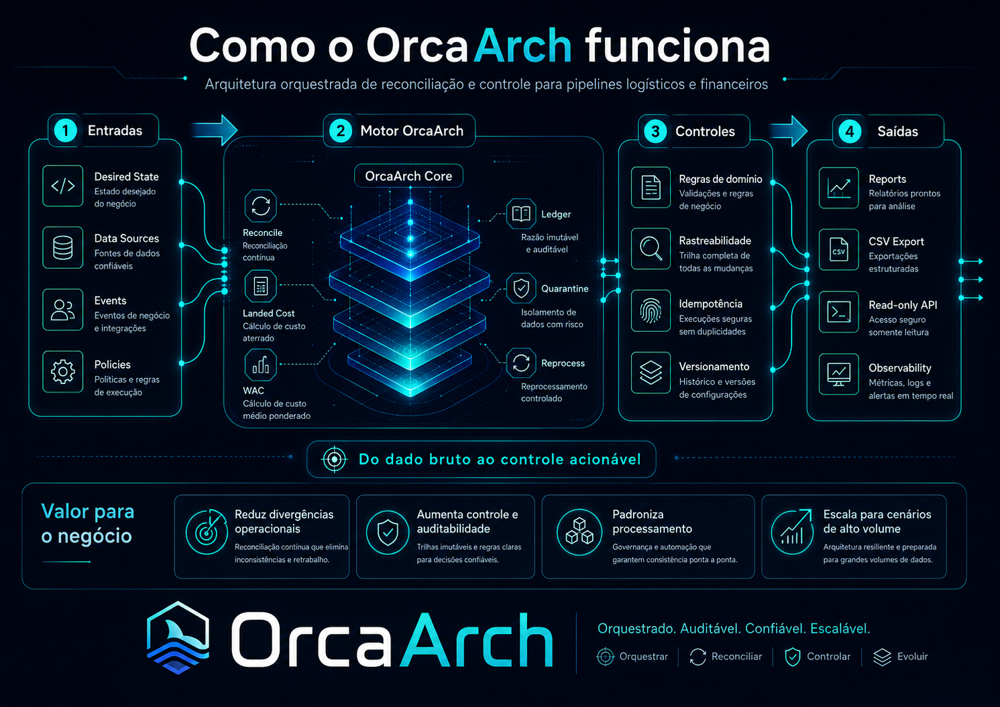

<p align="center">
  
</p>

# OrcaArch

[English](#orcaarch) · [Português](#orcaarch-pt-br)

---

Reconciliation engine playground for domain-specific pipelines — logistics and financial.

Built in Go with Clean Architecture, integer-scaled Money, deterministic mock data, and a structured AI-assisted development workflow.

## How OrcaArch works

<p align="center">
  
</p>

## Getting Started

OrcaArch is already available as a public GitHub repository and can be tested locally today.

The `create-orcaarch` package has not been published to npm yet. Until npm publication, use `npm link` to test the CLI locally.

### 1. Clone the repository

```bash
git clone https://github.com/GRhama/orcaarch.git
cd orcaarch
```

### 2. Run the Go test suite

```bash
go test ./...
```

This validates the logistics reconciliation engine, including domain rules, service orchestration, reporting, export, and API packages.

### 3. Run the API locally

```bash
make run-api
```

The API starts on port `8080` and exposes read-only report endpoints:

```bash
curl -s http://localhost:8080/api/v1/reports/inventory | head -c 300
curl -s http://localhost:8080/api/v1/reports/ledger | head -c 300
curl -s http://localhost:8080/api/v1/reports/risk | head -c 300
```

### 4. Export CSV reports

```bash
make export-csv
```

This generates:

```text
reconciliation.csv
ledger.csv
risk.csv
```

### 5. Test the CLI locally

The CLI is designed to be used as `create-orcaarch`. Since the npm package is not published yet, link it locally first:

```bash
cd installer/create-orcaarch
npm link
```

Then generate a demo project from any temporary directory:

```bash
cd /tmp
mkdir orcaarch-demo
cd orcaarch-demo

create-orcaarch
```

Follow the prompts:

```text
Project name: demo
Scenario: Logistics / Supply Chain
Volume: 1_000
```

Then run the generated scaffold:

```bash
cd demo
make run            # print pipeline config
make reports        # generate CSV in ./output (clones engine automatically)
make api            # start API on localhost:8080 (clones engine automatically)
make help           # list all available targets
```

The scaffold is operational: `make reports` generates real CSV files and `make api` starts the read-only API. The OrcaArch engine is cloned into `.orcaarch/source` automatically on first use — no manual setup needed.

To remove the local CLI link:

```bash
npm unlink -g create-orcaarch
```

### Planned npm usage

After the package is published to npm, the intended usage will be:

```bash
npx create-orcaarch
```

For now, use the local `npm link` workflow above.

## Source engine

```bash
go test ./...
go test ./internal/service/... -bench=. -benchmem
make run-api      # starts API on :8080
make export-csv   # writes reconciliation.csv, ledger.csv, risk.csv
```

## Scenarios

| Scenario | Status |
|---|---|
| Logistics / Supply Chain | ✅ Implemented |
| Financial / Banking | 🔵 In Design — see [docs/FINANCIAL_SCENARIO_DESIGN.md](docs/FINANCIAL_SCENARIO_DESIGN.md) |

## What this demonstrates

- Go engineering: Clean Architecture, no ORM, no framework
- Money without floating point: integer-scaled `int64`, no `float32`/`float64`
- Reconciliation logic: matching, discrepancy detection, exception queue
- Idempotent reprocessing: reversal + recalculation + version increment
- Double-entry ledger: accounting entries per reconciliation status
- Deterministic mock data: fixed-seed generator, reproducible at any volume
- Read-only API: stdlib `net/http` only
- CSV export: standard library only
- Benchmarks: O(n) processing validated at 50k–250k records
- Multi-scenario architecture: pluggable domains, shared patterns, no forced abstraction
- Structured AI-assisted development with human review gates

## Requirements

- Go 1.22+
- Node 16+ (for CLI testing via `npm link`; or `npx create-orcaarch` after publish)

## Documentation

- [Architecture](docs/ARCHITECTURE.md)
- [API First](docs/API_FIRST.md)
- [AI Workflow](docs/AI_WORKFLOW.md)
- [Product Case](docs/PRODUCT_CASE.md)
- [Scenarios](docs/SCENARIOS.md)
- [Benchmarks](docs/BENCHMARKS.md)
- [Financial Scenario Design](docs/FINANCIAL_SCENARIO_DESIGN.md)

---

# OrcaArch PT-BR

OrcaArch é um motor de reconciliação construído em Go, organizado em pipelines por domínio. O projeto demonstra que um Product Manager com visão técnica consegue arquitetar e entregar uma solução multi-cenário — com suporte de IA estruturado e revisão humana em cada etapa.

## O que é

Motor de reconciliação configurável por domínio. Cada cenário tem suas próprias regras de negócio, mas compartilha os mesmos padrões arquiteturais: Clean Architecture, Money em inteiro escalado, dados mock determinísticos, API somente-leitura e exportação CSV.

## Por que existe

Provar que a combinação de visão de produto + workflow de IA bem estruturado + Go clean entrega software técnico de qualidade sem precisar de uma equipe de engenharia. O fluxo completo — do insumo até o CSV e a API — está acima neste README.

## Como testar localmente

O OrcaArch já está disponível como repositório público no GitHub e pode ser testado localmente hoje.

O pacote `create-orcaarch` ainda não foi publicado no npm. Até a publicação, use `npm link` para testar a CLI localmente.

### 1. Clone o repositório

```bash
git clone https://github.com/GRhama/orcaarch.git
cd orcaarch
```

### 2. Rode a suíte de testes em Go

```bash
go test ./...
```

Esse comando valida o motor logístico de conciliação, incluindo regras de domínio, orquestração de serviço, relatórios, exportação e API.

### 3. Rode a API localmente

```bash
make run-api
```

A API sobe na porta `8080` e expõe endpoints read-only de relatórios:

```bash
curl -s http://localhost:8080/api/v1/reports/inventory | head -c 300
curl -s http://localhost:8080/api/v1/reports/ledger | head -c 300
curl -s http://localhost:8080/api/v1/reports/risk | head -c 300
```

### 4. Exporte relatórios CSV

```bash
make export-csv
```

Esse comando gera:

```text
reconciliation.csv
ledger.csv
risk.csv
```

### 5. Teste a CLI localmente

A CLI foi desenhada para ser usada como `create-orcaarch`. Como o pacote ainda não foi publicado no npm, primeiro crie o link local:

```bash
cd installer/create-orcaarch
npm link
```

Depois gere um projeto demo a partir de qualquer diretório temporário:

```bash
cd /tmp
mkdir orcaarch-demo
cd orcaarch-demo

create-orcaarch
```

Responda aos prompts:

```text
Project name: demo
Scenario: Logistics / Supply Chain
Volume: 1_000
```

Depois rode o scaffold gerado:

```bash
cd demo
make run            # exibe config do pipeline
make reports        # gera CSV em ./output (clona engine automaticamente)
make api            # sobe API em localhost:8080 (clona engine automaticamente)
make help           # lista todos os targets disponíveis
```

O scaffold é operacional: `make reports` gera CSVs reais e `make api` sobe a API read-only. O engine OrcaArch é clonado em `.orcaarch/source` automaticamente no primeiro uso — nenhuma configuração manual necessária.

Para remover o link local da CLI:

```bash
npm unlink -g create-orcaarch
```

### Uso futuro via npm

Depois que o pacote for publicado no npm, o uso pretendido será:

```bash
npx create-orcaarch
```

Por enquanto, use o fluxo local com `npm link`.

## Cenários

| Cenário | Status |
|---|---|
| Logistics / Supply Chain | ✅ Implementado |
| Financial / Banking | 🔵 Em Design — ver [docs/FINANCIAL_SCENARIO_DESIGN.md](docs/FINANCIAL_SCENARIO_DESIGN.md) |

## Desenvolvimento assistido por IA

O projeto foi desenvolvido com workflow de IA estruturado: cada tarefa tem contexto mínimo definido, gates de revisão humana e rastreabilidade de decisão. Nenhum artefato foi gerado e aceito cegamente — toda decisão arquitetural foi revisada e documentada.

## API First

Toda a lógica de negócio é acessível via API HTTP antes de qualquer integração externa. Isso permite validar o comportamento do motor de reconciliação de forma isolada, sem depender de banco de dados ou serviços externos.

## Documentação

- [Arquitetura](docs/ARCHITECTURE.md)
- [API First](docs/API_FIRST.md)
- [Workflow com IA](docs/AI_WORKFLOW.md)
- [Caso de Produto](docs/PRODUCT_CASE.md)
- [Cenários](docs/SCENARIOS.md)
- [Benchmarks](docs/BENCHMARKS.md)
- [Design do Cenário Financeiro](docs/FINANCIAL_SCENARIO_DESIGN.md)
